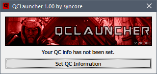
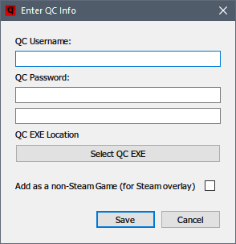

#  QCLauncher

----------

What Is QCLauncher?
-------------

QCLauncher is a small tool for [Quake Champions](https://www.quake.com). With it, you can launch Quake Champions *without running the Bethesda Launcher or having the Bethesda Launcher open*. QCLauncher has just 2 files, uses very few resources, and immediately exits after launching the game. You can download it [here.](https://github.com/syncore/qclauncher/releases)

 **It is very important to recognize that QCLauncher does not entirely replace the Bethesda Launcher. Most importantly, you will still need the Bethesda Launcher to download any QC game updates** or to verify your game files if you need to do that. By default, QCLauncher will tell you when Quake Champions game updates are available and you will be unable to play if you do not have the latest version of Quake Champions from Bethesda.

Why?
----

 - The Bethesda Launcher:
	 -  Is basically a [special version](https://bitbucket.org/chromiumembedded/cef) of the Chrome web browser that sits in the background while you play. Depending on your system, this may be heavy on resources for you.
	 - May display [messages at inconvenient times](https://www.reddit.com/r/QuakeChampions/comments/6kffch/dear_bethesda_do_not_do_this/).
 - It is currently not possible to use the login screen in Quake Champions.
 - Easily add Quake Champions to Steam and use the Steam overlay until [official Steam support arrives.](http://www.pcgamer.com/quake-champions-will-run-through-steam-id-software-confirms/)

----------

Download
-------------

:floppy_disk: You can download both the latest version of the binary and source code [from the releases page.](https://github.com/syncore/qclauncher/releases)

Requirements
-------------

 - A free [Bethesda account](https://account.bethesda.net/en/join) with [Quake Champions](https://quake.bethesda.net/en/signup) installed and added to your account.
 - A 64-bit version of Windows (you can't play QC without this anyway)

How to Use (Setup)
-------------

 1. Download the [latest release](https://github.com/syncore/qclauncher/releases) and extract the `qclauncher.exe` file from the zip file.
 2. Double click `qclauncher.exe` to run QCLauncher.
 3. Enter the requested information. For the QC user name and password, this will be the same info used for the Bethesda launcher (or the Bethesda forums)
 4. Click the "Select QC EXE" button to locate your Quake Champions exe file; by default, this will be located at: `C:\Program Files (x86)\Bethesda.net Launcher\games\client\bin\pc\QuakeChampions.exe`
 5. Select the language you wish to use for Quake Champions.
 6. *Steam (Optional)*: If you want to add Quake Champions as a non-Steam game, click the check box. When prompted, find and select `qclauncher.exe` in Steam to add it as a non-Steam game. You can rename it to Quake Champions if you want, so that name will be displayed in your friends list.
 7. Click the 'Save' button. If successful, the launcher will exit. In the future, simply click the `qclauncher.exe` file to launch Quake Champions and play.

How Do I Change My Settings/Account After Saving?
-------------

Delete the `data.qcl` file that is in the same location as `qclauncher.exe`. Then re-run `qclauncher.exe`. This behavior is somewhat crude at the moment and may change in the future. I am open to [suggestions.](https://github.com/syncore/qclauncher/issues)

Build from Source Code
-------------

 1. Download and install the latest stable release of the Go Programming Language, which is [available here.](https://golang.org/dl/)
 2. *Windows* - To get the QCLauncher source: `go get -ldflags="-H windowsgui -s -w" github.com/syncore/qclauncher`
 3. *Linux* - To get the QCLauncher source: `GOOS=windows GOARCH=amd64 go get -d -ldflags="-H windowsgui -s -w" github.com/syncore/qclauncher`
 4. Find your GOPATH. This can be found by entering:  `go env GOPATH` on the command line.
 5. Change directory to `GOPATH\src\github.com\syncore\qclauncher`
 6. *Windows* - To build, run `build.bat`
 7. *Linux* - To build, run `build.sh` (the application only runs on Windows, but can be built on Linux/OSX).
 8. If everything went well, you should have the `qclauncher.exe` file in the `bin` directory.

Is This Considered a Cheat?
-------------
Not to my knowledge. QCLauncher **does *NOT* touch or modify any game files or game code at all**. It is simply a very lightweight utility that launches the game. Use it if you'd like to, or not. I wrote it as a learning exercise in the [tradition](https://qlprism.syncore.org/) of [contributing](https://ql.syncore.org) to the Quake [community](https://qlprism.syncore.org/qlm/). It's open-source. Inspect the code and you will see that there is no funny business going on.

Issues, Contact Me, etc.
-------------

I can be contacted under the name **syncore** on [Discord](https://discordapp.com/). Any other issues can be opened on the [issue tracker here on Github,](https://github.com/syncore/qclauncher/issues) and I will try to address them, time permitting. Additionally, there is an ESR thread available [here.](http://www.esreality.com/post/2877585/quake-champions-quick-launcher/)

:thumbsup: :video_game: *Happy fragging, and please support this latest Quake title! Download it for free at https://www.quake.com*